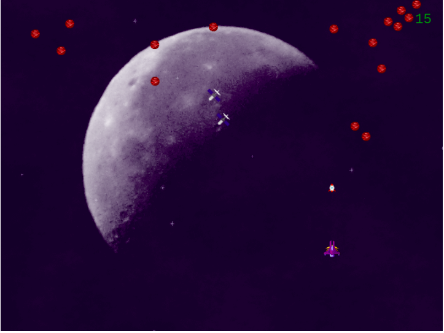

# Shooter Game


## About the Project

This project is a javascript game built with Phaser 3 where a player is expected to shoot down debris from the sky before they collide.

## Table of Contents

* [About the Project](#about-the-project)
* [Built With](#built-with)
* [Live Demo](#live-demo)
* [Game Design Document(GDD)](#game-design-document)
* [Getting Started](#getting-started)
* [How to run tests](#tests)
* [Authors](#authors)
* [Contributing](#contributing)
* [Show your support](#show-your-support)
* [License](#license)
* [Acknowledgements](#acknowledgements)

## Built With

* [HTML5](https://en.wikipedia.org/wiki/HTML5)
* [JavaScript](https://en.wikipedia.org/wiki/JavaScript)
* Phaser 3

## Live Demo
[Live Demo Link](https://www.binyamhailemeskel.me/Shooter-Game/build/)

## Game Design Document
[Game Design Document (GDD) Link](./game-design-document.md)
## Getting Started

### How to play.
1. Enter name in the name field and click start
2. Click play to start the game
3. Click leaderboard to see scores of previous players
4. Once the game starts, use the left and right arrow keys to move the spaceship to left and right
5. Use spacebar to shoot down the red asteroids before they crash into the statellites
6. The game ends when all the satellites are hit by the asteroids.
### To get a local copy up and running follow these simple example steps.

1. On the project GitHub page, navigate to the main page of the repository.
2. Under the repository name, locate and click on a green button named `Code`. 
3. Copy the project URL as displayed.
4. If you're running the Windows Operating System, open your command prompt. On Linux, Open your terminal. 
5. Change the current working directory to the location where you want the cloned directory to be made. Leave as it is if the current location is where you want the project to be. 
6. Type git clone, and then paste the URL you copied in Step 3. <br>
e.g. $ git clone https://github.com/yourUsername/yourProjectName 
7. Press Enter. Your local copy will be created. 

### To view the app in your browser
1. Open your terminal and navigate to the projects folder.
2. run the following commands
```
npm install
npm run serve
```
3. Open your browser and go to
```
http://localhost:8080/
```
## How to run tests
 - ``` npm install``` to install all dependencies needed for testing.
 - Execute ```npm test``` to run all the tests.
## Authors

👤 **Binyam Hailemeskel**

- GitHub: [@bini-i](https://github.com/bini-i)
- Twitter: [@binyamshewa](https://twitter.com/binyamshewa)
- LinkedIn: [binyam hailemeskel](https://www.linkedin.com/in/bini-i/)

## Contributing

Contributions, issues, and feature requests are welcome!
1. Fork the Project
2. Create your Feature Branch (`git checkout -b feature/AmazingFeature`)
3. Commit your Changes (`git commit -m 'Add some AmazingFeature'`)
4. Push to the Branch (`git push origin feature/AmazingFeature`)
5. Open a Pull Request


## Show your support

Give a ⭐️ if you like this project!


## License

This project is [MIT](./LICENSE) licensed.


## Acknowledgements
* The project's UI and styling is based on the design template made by [Nelson Sakwa](https://www.behance.net/sakwadesignstudio)
* [rails guides](https://guides.rubyonrails.org/)
* [bootsrap](https://getbootstrap.com/)
* [rspec rails gem](https://github.com/rspec/rspec-rails)
* [shoulda matchers gem](https://github.com/thoughtbot/shoulda-matchers)
